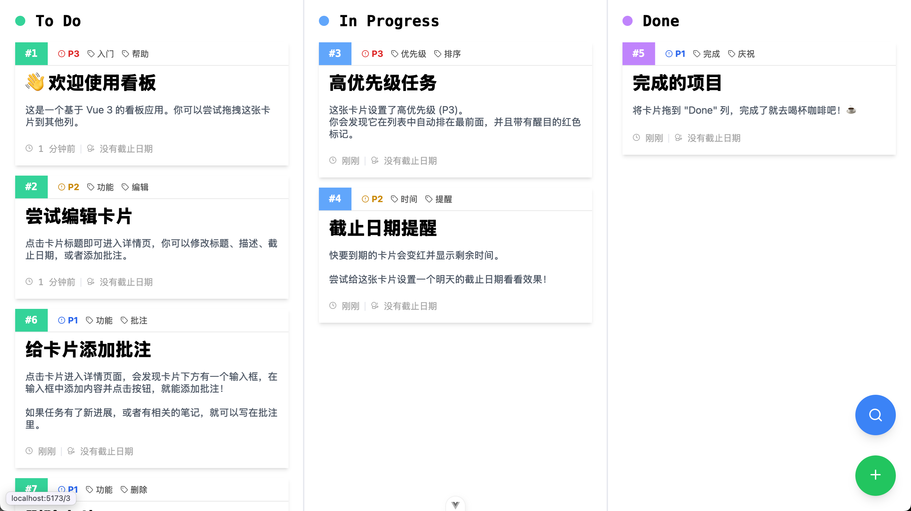

# Vue Kanban

一个基于 Vue.js 3 的看板应用，可用于任务管理和笔记管理。

## 技术栈

- Vue.js 3
- Vite
- Element Plus
- UnoCSS

## 开发

1. 安装依赖。项目使用 Bun 管理依赖，应该兼容 NPM。

```bash
bun install
# or
npm install
```

2. 运行项目。

```bash
bun dev
# or
npm run dev
```
